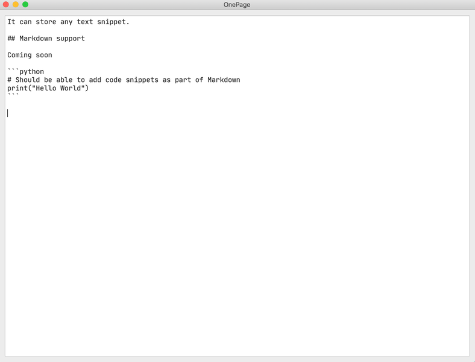

## OnePage

:: Simple ScratchPad supporting only one page

### Some features:

🚀 Only allows you to create a single note

🚀 No possibility of creating multiple notes so your notes are always in front

🚀 Single App across platforms

🚀 Remove any formatting style

🚀 Auto-save notes

#### Downloads

Downloads are currently available for MacOS and Windows.

[Mac OS App](https://github.com/namuan/one-page-releases/releases/download/0.3.0/onepage-macos-0.3.0.zip)

[Windows App](https://github.com/namuan/one-page-releases/releases/download/0.3.0/onepage-win-0.3.0.zip)

[Linux from Source](docs/installation.md)
